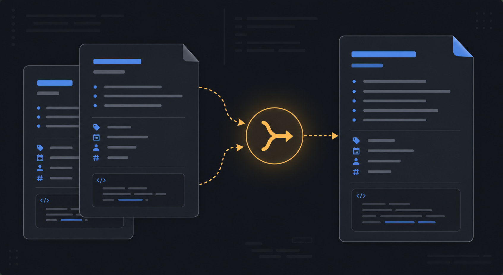

# Power Merge Notes

Merge Markdown notes into one while preserving useful structure. Merge Notes combines duplicate content under matching headings, reconciles selected frontmatter fields, and handles Dataview code blocks with explicit rules.

> The image is an illustrative example of the workflow, not a screenshot of the plugin.

## Capabilities

- **Manual merge:** choose two notes from Command Palette.
- **Selected-file merge:** merge multiple selected notes from the File Explorer context menu.
- **Duplicate scan:** merge duplicates in the active file's folder.
- **Rename with merge:** rename a note and merge into an existing target when the name collides.
- **Automatic cleanup:** detect same-name Markdown duplicates when notes are created or renamed.
- **Heading-aware merge:** append source content under matching headings and keep distinct headings.
- **Frontmatter merge:** retain title and date from the preferred note; deduplicate aliases and tags.
- **Dataview handling:** deduplicate repeated dataview blocks and select the most recently updated dv.view block when applicable.

## Install

Copy this folder to <vault>/.obsidian/plugins/Power-Merge-Notes/, then enable **Power Merge Notes** under Settings → Community plugins.

To build from source:

~~~bash
npm install
npm run build
~~~

Use npm run dev for watch mode if supported by the local package scripts.

## Usage

### Merge two notes

1. Open Command Palette.
2. Run **Merge two notes…**.
3. Choose the first and second note.
4. Select **Old Into New** or **New Into Old**.
5. Review the result and confirm the secondary-note behavior.

### Work with duplicates

Use **Merge duplicates in active file's folder** to scan the current folder, or enable **Auto-merge same-name duplicates** in settings. Common duplicate suffixes such as (1), - Copy, and Obsidian Sync conflict titles are normalized.

By default, the secondary note moves to system trash after a successful merge. Disable **Trash secondary after merge** to keep both files.

## Settings

- **Auto-merge same-name duplicates**
- **Default preference**
- **Trash secondary after merge**
- **Verbose console logs**
- **Auto-merge debounce (ms)**

Heading comparisons are exact and case-sensitive. Back up or use version history before large merges.

## License

MIT. See [LICENSE](LICENSE).

